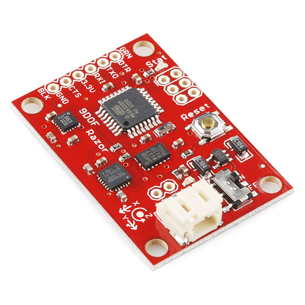

# razor

# Introduction
The Razor IMU is a 9 degree of freedom inertial measurement unit from [sparkFun](https://www.sparkfun.com/) Electronics. It consists of a ITG-3200 (MEMS triple-axis gyro), ADXL345 (triple-axis accelerometer), and HMC5883L (triple-axis magnetometer) - to give nine degrees of inertial measurement. The outputs of all sensors are processed by an on-board ATmega328 and output over a serial interface.

<p align="center">
  
</p>
<p align="center">
    Fig: Razor IMU
</p>

This library is meant for use in programming a receiving ATmega microcontroller. The microcontroller receives the IMU data over a serial UART bus. It is assumed that the IMU is already programmed to send the calibrated Roll Pitch and Yaw data. If unfamiliar check this [tutorial](https://github.com/Razor-AHRS/razor-9dof-ahrs/wiki/Tutorial).

# Index
- [Introduction](#introduction)
- [Index](#index)
- [Users Guide](#users-guide)
    - [Downloading This Library](#downloading-this-library)
    - [Examples](#examples)
- [Developers Guide](#developers-guide)
    - [Files](#files)
    - [Class Description](#class-description)

# Users Guide
## Downloading This Library
It is recommended to clone the entire repository into the  libraries folder of the installed Arduino folder  on your local machine. Use the command:
```
git clone https://github.com/arthurgomes4/razor.git
```
Ensure that the command is run from the mentioned libraries directory. 

**Note**: This library is dependent on [sio](https://github.com/arthurgomes4/sio) for debugging and UART data processing functionalities so ensure that you have it downloaded as well in the same libraries folder.


## Examples
(to be updated soon)

# Developers Guide
## Files
A description of all files contained in this library folder.

### razor.h
This is the header file containing the class blueprints.

### razor.cpp
This file contains the source code for the function prototypes declared in the header file. 

### keywords.txt
This file is used by Arduino IDE for syntax highlighting of keywords.

### README.md
A markdown file containing the general description of the library.

## Class Description
The contents of the **sio** class are detailed and listed further in this section.

[](https://code.visualstudio.com/)
[](https://github.com/arthurgomes4)
